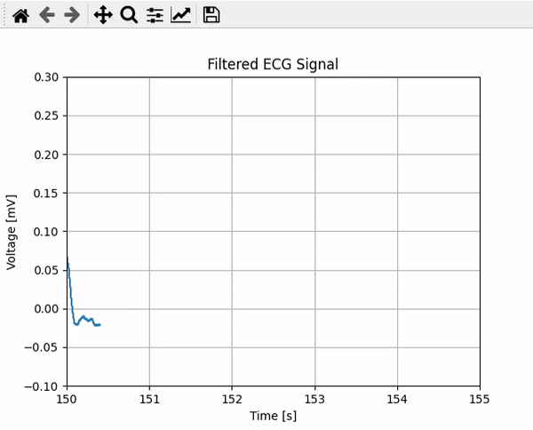

# ECG Monitor

### Disclaimer
This app provides only information for educational purposes. This app is not medical or treatment advice, professional diagnosis, opinion, or services – and may not be treated as such by the user. As such, this app may not be relied upon for the purposes of medical diagnosis or as a recommendation for medical care or treatment. The information provided by this app is not a substitute for professional medical advice, diagnosis or treatment.

### General
A simple script to display ECG waveform graphs based on data previously collected from the ECG recorder. The script accepts a CSV file whose first column contains time samples and the second column contains ECG signal samples. The signal is filtered using a Butterworth bandpass filter.

### Usage
```
positional arguments:
  fname                 File path

options:
  -h, --help              show this help message and exit
  -fs FS                  Sampling frequency; default 1000Hz
  --delimiter DELIMITER   Columns delimiter; default ','
  -tstart TSTART          Signal recording start time in seconds; default 0
  -tstop TSTOP            Signal recording stop time in seconds; default signal duration time
  --lowcut LOWCUT         Butterworth filter lowcut frequency [Hz]; default 0.5Hz
  --highcut HIGHCUT       Butterworth filter highcut frequency [Hz]; default 150Hz
  -dt DT                  Displaying window width as time in seconds; default 5s
```

### Demo
```
python ecg_monitor.py 'ecg.csv' -tstart 140
```

<br/>

```
python ecg_monitor.py 'ecg.csv' -tstart 100 --lowcut 0.1
```

<p>Too low filter lowcut value - low frequencies components (breathing chest movements) causes signal floating.</p>


